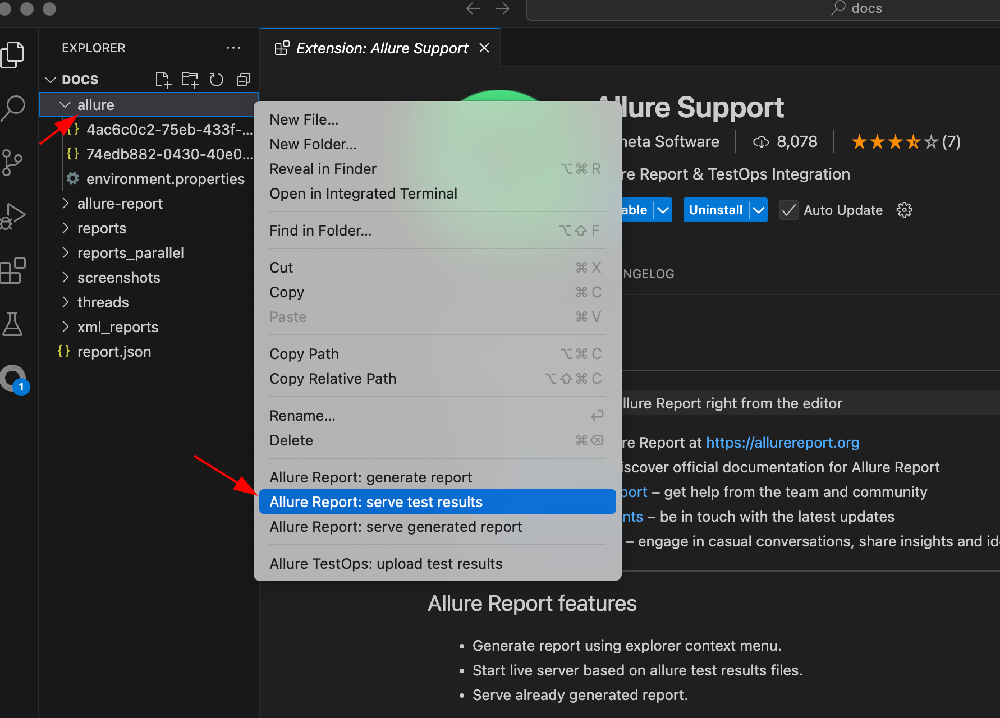
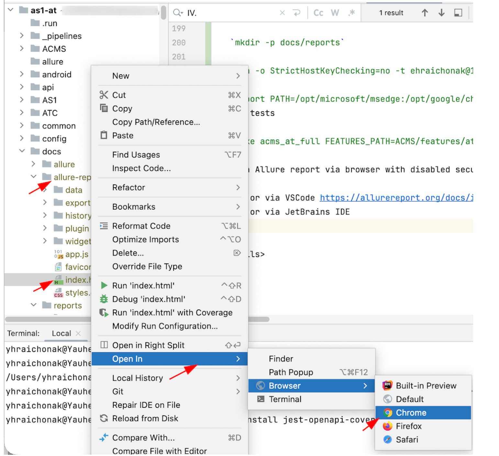

# UTANG - Test Automation Framework

Here pre-setup steps could be found: [Automation common requirements](https://utang.atlassian.net/wiki/spaces/TT/pages/3143696421/Automation+common+requirements).

<details>
  <summary >I. Setup project</summary>


1. Install Homebrew (mac)
   >/bin/bash -c "$(curl -fsSL https://raw.githubusercontent.com/Homebrew/install/HEAD/install.sh)"

2. Install GnuPG and freetds (mac)
   > brew install gnupg gnupg2 freetds

3. Install RVM and ruby

   - requires RVM (visit for setup on platform machine - https://rvm.io/)
   >gpg --keyserver hkp://pool.sks-keyservers.net --recv-keys XXXXXX XXXXXXX

   >curl -sSL https://get.rvm.io | bash -s stable

   - requires Ruby 2.7.0 (visit for installing ruby with RVM - https://rvm.io/rubies/installing)
   >rvm install ruby-2.7.0

4. Install browsers
- requires Google Chrome browser
- requires Microsoft Edge browser
5. In Project Folder:

   >gem install bundler\
   >bundle

   this will install all gems dependencies in the project.  See Gemfile.lock for all gems and dependencies

   Note: if issues installing mimemagic gem...run following commands:

   >brew install shared-mime-info

   >gem install mimemagic

</details>

<details>
  <summary>II. Web Client AT</summary>

1. **Cucumber runner**

   >cucumber AS1/features/pm/monitor/liveMonitor.feature -r AS1/features/

   Additional parameters that can be added for test configuration through command line; please see AS1/features/lib/helpers/env_variables.rb for configurations and defaults

   * ENVIRONMENT - executes tests to a qa test site **(default: 34)**
      - ENVIRONMENT='34'
      - ENVIRONMENT='35'
      - ENVIRONMENT='automation'

   * BRANCH - execute tests on web branch site deployed on dev-host-03 **(default: rc)** **(Unused in automation enviroment)**
      - BRANCH='develop'
      - BRANCH='rc'
      - BRANCH='release'
   * BROWSER - executes tests on which web browser; currently only chrome and edge, IE11 slow and not stable **(default: chrome)**
      - BROWSER='chrome'
      - BROWSER='edge'
   * GRID - executes on internal selenium grid **(default: false)**
      - GRID='true'
   * GRID_IP - configuration for where selenium grid is setup on **(default: localhost)**
      - GRID_IP='20.88.170.33'
   * APP_VERSION: <br /> This value is used to validate whether or not the info page is functioning correctly. If it is not set, those tests will most likely fail.
   * APP_BUILD_NUMBER: <br /> This value fill the same role as APP_VERSION.

   Example: to execute liveMonitor.feature on site35, webclient release branch, on Edge browser
   > cucumber AS1/features/pm/monitor/liveMonitor.feature -r AS1/features/ ENVIRONMENT='automation' BRANCH='rc' BROWSER='edge'

2. **Rake runner**

   Rake build tool could be used as a wrapper for test automation run (see Rakefile in the project root). Following rake tasks are defined in WebClient test automation

   - `web_at` - task that wraps cucumber CLI execution with actual tests trigger
   - `web_at_full` - includes `web_at` plus pre-step `reset` (to cleanup ad prepare directories) + post-step `allure-generate` to generate Allure report
   - `web_at_full_tr` - includes  `web_at_full` + plus task that exports results to TestRail using `export_tr`
   - `web_at_parallel` - task for running tests in parallel TBD
   - `web_at_parallel_full` - includes `reset`+`web_at_parallel` +`allure-generate`

   Additional parameters that can be added as environment variables  to Rake

| Parameter                 | Default value | `   Description                                                                                                                                                 |
|:--------------------------|:-------------:|:----------------------------------------------------------------------------------------------------------------------------------------------------------------|
| ENVIRONMENT               |      34       | Environemnt under the test (34/35/autromation)                                                                                                                  |
| BRANCH                    |      rc       | Branch of the environment to be testses (used as part of URL rc/release)                                                                                        |
| BROWSER                   |    chrome     | Test in browser (chrome/edge)                                                                                                                                   |
| BROWSER_VERSION           |    latest     | Version of the `browser`                                                                                                                                        | 
| CUCUMBER_STEPS            | AS1/features/ | Relative path to cucumber steps definitions                                                                                                                     | 
| FEATURES_PATH             | AS1/features/ | Relative path to cucumber features fodler/files to execute (could be multiple space separated values)                                                           | 
| TAGS                      |               | List of tags to be included in test run (for ex `--tags @tag1  --tags "@tag2 or @tag3"`)                                                                        | 
| SCENARIO_NAME             |               | Rgexp for the name of the scenario to be executed (for ex `.*(Live Monitor).*`)                                                                                 |
| DRY_RUN                   |     false     | Run tests in dry run mode (without actual execution)                                                                                                            |
| TR_EXECUTION              |     UNDEF     | Test Rail execution ID. Passed when results should be exported to TestRails (or candidates for run from TR). Used by `export_tr` and  `tr_execution_candidates` |
| TR_OVERWRITE              |     true      | Overwrite Test Rail test execution results (if already executed). Used by `export_tr` task.                                                                     |
| TR_NON_EXECUTED_ONLY      |     true      | Extract only non executed test candidates from Test Rail. Used by `tr_execution_candidates` task.                                                               |
| APP_VERSION               |    4.0.0.     | Version of the app under the test                                                                                                                               |
| APP_BUILD                 |      26       | Build of the app under the test                                                                                                                                 |
| GRID                      |     false     | Execute tests in Selenium grid                                                                                                                                  |   
| GRID_IP                   |   localhost   | Selenium hub ip address (works only with `GRID` parameter)                                                                                                      |  
| RETRIES                   |       2       | Number of retries to be done for failed tests                                                                                                                   |
| THREADS                   |       4       | Number of paralllel thread to be used (when `cucumber_parallel` is used)                                                                                        |
| ADDITIONAL_OPTIONS        |               | Any additional parameters that could be passed as KEY=VALUE list (for ex test data customization)                                                               |


Execution samples:

| Description                                                                                                                     | `   Command                                                                                                                                                                                                                                                                                                        |
|:--------------------------------------------------------------------------------------------------------------------------------|:-------------------------------------------------------------------------------------------------------------------------------------------------------------------------------------------------------------------------------------------------------------------------------------------------------------------|
| Regular WebClient test automation run                                                                                           | ```>rake web_at_full DRY_RUN=false  ENVIRONMENT=automation BRANCH=rc BROWSER=chrome HEADLESS=false  FEATURES_PATH=AS1/features/pm/monitor/liveMonitor.feature TAGS='--tags @automated' APP_VERSION=4.1.0 APP_BUILD=3433 GRID=false ADDITIONAL_OPTIONS='QTC=false NO_ECG_PATIENT="da Vinci, Leonardo"' RETRIES=2``` |
| Dry run of WebClient automation (integrity check)                                                                               | ```>rake web_at_full DRY_RUN=false FEATURES_PATH=AS1/features/pm/monitor/liveMonitor.feature TAGS='--tags @automated'```                                                                                                                                                                                           |
| Export results to TestRail (assuming preliminary tests execution was done and files testsRun.txt/failed.txt are present         | ```>rake export_tr ENVIRONMENT=34 BRANCH=rc APP_VERSION=4.1.0 APP_BUILD=3540 BROWSER=edge TR_EXECUTION=13170 TR_OVERWRITE=False```                                                                                                                                                                                 |
| Extract test execution candidates from TestRail run (tests marked as @automated but not executed yet) to tr_exec_candidates.txt | ```>rake tr_execution_candidates TR_EXECUTION=13130 TR_NON_EXECUTED_ONLY=True FEATURES_PATH=AS1/features```                                                                                                                                                                                                        |
| Delete duplicated test execution results from Xunit reports                                                                     | ```>rake clear_xunit_duplicated```                                                                                                                                                                                                                                                                                 |

3. **Parallel execution (TODO)**

4. **Test data parameters for AUTOMATION environment**

* PATIENT: <br /> This is the default patient. This value will override the patient name for every test step that uses <br /> `I click on "(.*?)" in patient list` <br /> The recommended default for the automation site is **"Ohm, Georg"**. Several of the tests require a specific patient configuration and "Ohm, Georg" has been modified to meet those requirements.
* CARDIO_PATIENT: <br /> This parameter overrides the patient name for tests that are running against cardio. **"Ohm, Georg"** Is the recommended default for this as well.
* NO_ECG_PATIENT: <br /> This must be a patient that has no ECGs. The current default for this parameter is **"da Vinci, Leonardo"**.

5. **Reporting**
   <a id="reporting"></a>
   * Cucumber and raw reporters. After every test run (via cucumber cli or rake) - raw reports created in CWD (working dir) `testsRun.txt` and `failed.txt` that contain list of all executed tests and failed tests (used for export to Test Rail feature).
     Native cucumber reports disabled by default and could be enabled by adding `--format html --out=docs/reports/html_report.html --format junit --out=docs/reports/xml_reports` to cucumber cli and will be published under `docs/reports`

   * Allure reports. Available when executed from rake (using tasks with suffix `_full` or by direct execution of `allure_generate` task). Open index.html file from `docs/allure-reports` in browser with enabled CORS
      * For raw allure results (not Allure report)  - install allure cli and execute `allure generate docs/allure`

</details>
<details>
  <summary>III. iOS AT</summary>

[iOS preparation](https://utang.atlassian.net/wiki/spaces/TT/pages/3143827571/iOS+Automation+run)
1. **Tests execution**

   - Cucumber cli
     ``` cucumber -r iOS/features/ iOS/features/cardio/ecgScreen/paperMode.feature  --tags @automated APP_PATH="/Users/qaautomation/BUILDS/One_QA.app" DEVICE="iPhone 13" VERSION="15.0" SITE_NAME=34 AS_VERSION="6.10.2" AS_MAN_DATE="2022/10/25" AS_BUILD_NUMBER="10015" INSTALL_SOFTWARE="false" UDI='+B15326010/$$7689/16D20211118-'```
      - APP_PATH - absolute path to the app under the test precompiled on local machine
      - DEVICE - target device simulator name
      - VERSION - target device simulator OS
      - SITE_NAME - test environment name (34/35/automation)
      - AS_VERSION - version number of the test app
      - AS_BUILD_NUMBER - build number of the test app
      - AS_MAN_DATE - test app build date (obsolete parameter)
      - UDI - value for auto-registering app
      - INSTALL_SOFTWARE - reinstall test app every time
   - Rake tasks
      -  `ios_at` - execute iOS test automation
      -  `ios_at_full` - execute iOS test automation + generate Allure report
      -  `export_tr_ios` - export test execution results (from testsRun.txt and failed.txt) to TestRail
      - Example: `rake ios_at_full FEATURES_PATH=iOS/features/cardio/ecgScreen/paperMode.feature DRY_RUN=False TAGS="--tags @automated"  DEVICE="iPhone 13" VERSION=15.0  AS_VERSION=6.10.2 AS_MAN_DATE=2022/10/25 AS_BUILD_NUMBER=10015 APP_PATH=/Users/qaautomation/BUILDS/One_QA.app SITE_NAME=34`
2. **Reports** [The same as for Web Client](#reporting)
  </details>
<details>
  <summary>IV. Android AT</summary>

[Android preparation](https://utang.atlassian.net/wiki/spaces/TT/pages/3143827600/Android+Automation+run)
1. **Tests execution**

   - Cucumber cli
     ``` cucumber -r android/features/ android/features/cardio/editConfim/confirmNoOrderNumber.feature  --tags @automated APP_PATH="/Users/qaautomation/Downloads/AS1-6.10.2-62[RC]-qa-debug.apk" DEVICE="Pixel110" VERSION="15.0" SITE_NAME=34 AS_VERSION="6.10.2" AS_MAN_DATE="2021/11/18" AS_BUILD_NUMBER="0"```
      - APP_PATH - absolute path to the app under the test precompiled on local machine
      - DEVICE - target device emulator name
      - SITE_NAME - test environment name (34/35/automation)
      - AS_VERSION - version number of the test app
      - AS_BUILD_NUMBER - build number of the test app
      - AS_MAN_DATE - test app build date (obsolete parameter)

   - Rake tasks
      -  `android_at` - execute Android test automation
      -  `android_at_full` - execute Android test automation + generate Allure report
      -  `export_tr_android` - export test execution results (from testsRun.txt and failed.txt) to TestRail
      -  Example: `rake android_at_full FEATURES_PATH=android/features/cardio/editConfim/confirmNoOrderNumber.feature DRY_RUN=False TAGS="--tags @automated" DEVICE=Pixel110 SITE_NAME=34 AS_VERSION=6.10.2 AS_BUILD_NUMBER=0 APP_PATH=/Users/qaautomation/Downloads/AS1-6.10.2-62[RC]-qa-debug.apk`
2. **Reports** [The same as for Web Client](#reporting)
</details>

V.   [ATC E2E AT](ACMS/README.md)
 <details>
  <summary>VI. Docker-based AT run</summary>

1.  Login into Docker registry

    `docker login -u dev-pull-access -p [TOKEN] utangtech.azurecr.io`

    [TOKEN] - request value from [Jonathan Irvin](email:jonathanirvin)
2. Pull Docker-image

   `docker pull utangtech.azurecr.io/at-runner/runner-ubuntu-ruby-3.2.2`
3. Run Docker container (from the project root)

   `docker run --rm -it --platform linux/amd64 --entrypoint bash -v $(pwd):/azp/tests utangtech.azurecr.io/at-runner:runner-ubuntu-ruby-3.2.2`
4. Configure test environment (from inside of container).

   `cd /azp/tests`

   `mkdir -p docs/reports`

   `bundle install`

   `ssh -o StrictHostKeyChecking=no -t ehraichonak@10.106.5.74 "exit"`

   `export PATH=/opt/microsoft/msedge:/opt/google/chrome/:$PATH`
5. Run tests

   `rake acms_at_full FEATURES_PATH=ACMS/features/atc/alert_dispatch/ad_alarm_queue_patient_cell.feature DRY_RUN=False 'TAGS=--tags @atc --tags "not @skip" --tags "not @obsolete"' 'SCENARIO_NAME= ' ENVIRONMENT=automation BROWSER=chrome THREADS=1 GRID_IP=20.88.170.33 GRID=False 'ADDITIONAL_OPTIONS= ' HEADLESS=True RETRIES=0`

6. Open Allure report via [browser with disabled security](https://allurereport.org/docs/gettingstarted-view-report/#open-local-directory-in-a-web-browser)

   -  either via [VSCode extension](https://allurereport.org/docs/integrations-vscode/)
      
   -  or via JetBrains IDE
      

</details>
